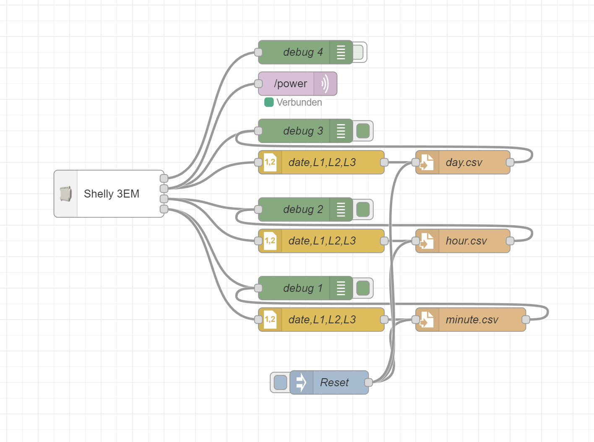
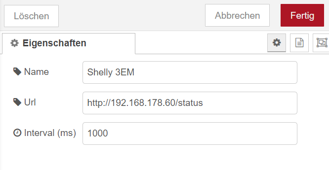

# Shelly 3EM

- Receives the status data via http.
- Configurable interval.
- supports daily energy and total energy. Also minutely and hourly.




Example minute output (day and hour are similar):

```json
{
    "date": "2024-10-06T06:03:00",
    "L1": 2.1000000000931323,
    "L2": 0.5,
    "L3": 0.1000000000349246
}
```

Example continuous output:

```json
{
    "dayId": "202480",
    "daySwitch": false,
    "L1": {
        "power": 197.77,
        "pf": 0.74,
        "current": 1.14,
        "voltage": 236.27,
        "is_valid": true,
        "total": 1184633.1,
        "total_returned": 1158.3,
        "total_day": 13.200000000186265
    },
    "L2": {
        "power": 21.34,
        "pf": 0.31,
        "current": 0.3,
        "voltage": 235.44,
        "is_valid": true,
        "total": 331873.1,
        "total_returned": 487.7,
        "total_day": 1.599999999976717
    },
    "L3": {
        "power": 8.83,
        "pf": 0.24,
        "current": 0.15,
        "voltage": 235.13,
        "is_valid": true,
        "total": 349600.5,
        "total_returned": 293.7,
        "total_day": 0.5
    },
    "total_power": 227.94,
    "total_day": 15.300000000162981
}
```
